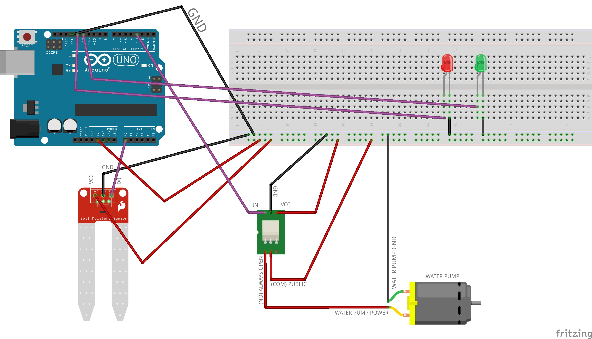

# Arduino Plant Watering Robot
> Automate plant watering using humidity sensors and Arduino

An excellent intermediate project for Arduino hobbiest and students. 

## Installation

OS X Linux Windows:

Go to Arduino.cc/downloads to install the IDE

## Materials

<ul>
<li>Arduino Uno</li>
<li>USB cable</li>
<li>servo</li>
<li>Prototyping wires</li>
<li>Hot glue</li>
<li>Mini breadboard</li>
<li>Cardboard</li>
<li>Humidity sensor</li>
<li>Relay</li>
<li>Aquarium water pump</li>
</ul>

## Circuit Diagram

## Release History

Sept 2016: Original prototype

Dec 2016: Official project of The Womens Foundation 'Girls Go Tech'

January 2017: Launched with Girls Go Tech

April 2017: 500+ girls have built the project to date

## Meta

Alice Walker – [@atatwalker](https://twitter.com/aliceemmwalker)

 This work is licensed under a <a rel="license" href="http://creativecommons.org/licenses/by-nc/4.0/">Creative Commons Attribution-NonCommercial 4.0 International License</a>.

[https://github.com/atatwalker/arduino-plant-watering-robot](https://github.com/atatwalker)

[npm-image]: https://img.shields.io/npm/v/datadog-metrics.svg?style=flat-square
[npm-url]: https://npmjs.org/package/datadog-metrics
[npm-downloads]: https://img.shields.io/npm/dm/datadog-metrics.svg?style=flat-square
